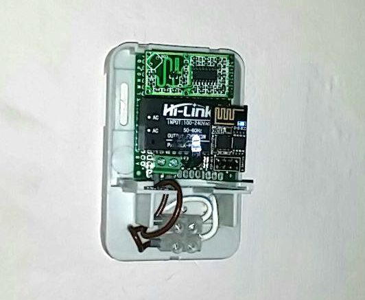
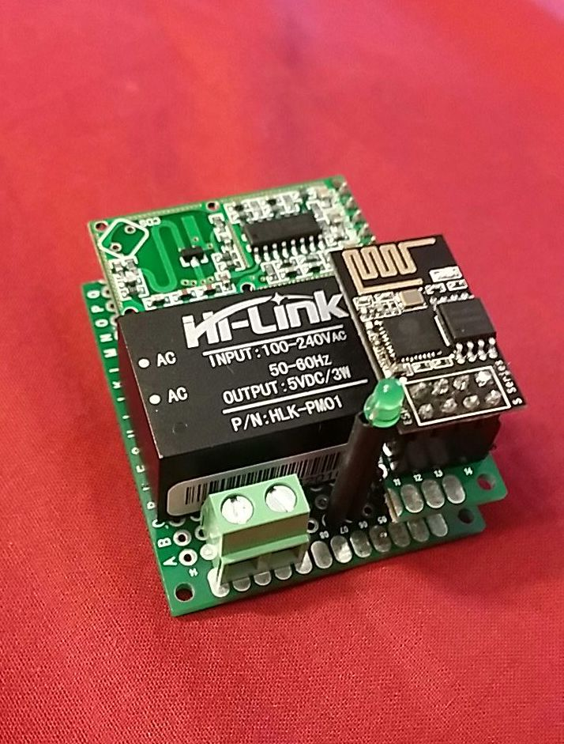
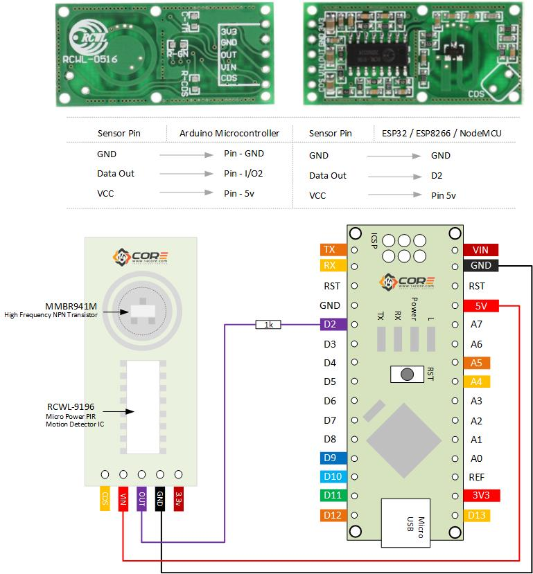

# WiFi motion sensor with ESP01 (ESP8266) and RCWL-0516 microwave motion sensor module on NodeMCU firmware (LUA)

Function | GPIO | NodeMCU
--- | --- | ---
RCWL-0516 out to ESP01 throw 1K ohm resistor | 2 | 4
Led throw 100 ohm resistor | 0 | 3

## Hardware
- Controller ESP01S (on ESP8266 chip)
- RCWL-0516 microwave motion sensor
- Resistors: 100 ohm and 1K ohm
- Led
- AMS1117 3.3v voltage regulator
- Hi-Link HLK-PM01 5v power supply

## MQTT
Outgoing messages

- /home/iot/{Device-IP}/out/online               *- ON - connectted to MQTT, OFF - disconnected (LWT)*
- /home/iot/{Device-IP}/out/motion               *- ON or OFF*
- /home/iot/{Device-IP}/out/state/uptime         *- Up time in seconds*
- /home/iot/{Device-IP}/out/state/memory         *- Free memory in bytes*
- /home/iot/{Device-IP}/out/state/relay          *- Relay status ON or OFF*

Input messages
- /home/iot/{Device-IP}/in/state/uptime         *No message*
- /home/iot/{Device-IP}/in/state/memory         *No message*
- /home/iot/{Device-IP}/in/state/relay          *No message*

## Installation
1. Install integer NodeMCU formware with modules: *file, gpio, mqtt, net, node, tmr, uart, wifi* (http://nodemcu-build.com/)
2. Install nodemcu-tool:
   *npm install nodemcu-tool -g*
3. Run *./upload.sh* to upload code
